# Gallery

Every scene in this repository, as built into [`docs/`](docs/). Nothing here is a screenshot: each
picture is the SVG the compiler wrote, and the animated ones are the timeline baked into the SVG
itself as SMIL, so they play wherever an SVG image renders — including this page on GitHub —
with no script at all. The pages under `docs/` play the same animations through the 9 kB
runtime instead, which also keeps dots and strokes a constant size as the camera zooms and
re-stacks parts as they pass one another; the self-playing copies scale everything with the
zoom and keep the resting paint order. See [CASE-STUDY.md](CASE-STUDY.md) for how the heroes
are made.

If a hero's image does not appear on GitHub, its file is over the image proxy's limit; the
still (`docs/<name>.svg`) always will, and the page always plays.

This file is generated by `node scripts/gallery-md.mjs` after a build. Edit the script, not
the file.

## Heroes

One-minute looping backgrounds with a moving camera.

### The Island of Misfit Applications

`islandHero` — self-playing SVG, 6.3 MB · [page](docs/islandHero.html) with the runtime, 1011 kB · [still](docs/islandHero.svg) · v6, earlier versions under [docs/versions](docs/versions/)

### The Island of Misfit Applications — dark

`islandHeroNight` — the same animation as its twin above; shown as a still, [self-playing copy](docs/islandHeroNight.anim.svg) 6.3 MB · [page](docs/islandHeroNight.html) with the runtime, 1002 kB · [still](docs/islandHeroNight.svg) · v6, earlier versions under [docs/versions](docs/versions/)


### An EDI lifecycle, end to end

`ediHero` — self-playing SVG, 3.2 MB · [page](docs/ediHero.html) with the runtime, 818 kB · [still](docs/ediHero.svg) · v2, earlier versions under [docs/versions](docs/versions/)

### An EDI lifecycle, end to end — on a meadow

`ediHeroMeadow` — self-playing SVG, 3.3 MB · [page](docs/ediHeroMeadow.html) with the runtime, 932 kB · [still](docs/ediHeroMeadow.svg) · v2, earlier versions under [docs/versions](docs/versions/)

### An EDI lifecycle, end to end — on a meadow, dark

`ediHeroMeadowNight` — the same animation as its twin above; shown as a still, [self-playing copy](docs/ediHeroMeadowNight.anim.svg) 3.3 MB · [page](docs/ediHeroMeadowNight.html) with the runtime, 925 kB · [still](docs/ediHeroMeadowNight.svg) · v2, earlier versions under [docs/versions](docs/versions/)


### An EDI lifecycle, end to end — dark

`ediHeroNight` — the same animation as its twin above; shown as a still, [self-playing copy](docs/ediHeroNight.anim.svg) 3.2 MB · [page](docs/ediHeroNight.html) with the runtime, 812 kB · [still](docs/ediHeroNight.svg) · v2, earlier versions under [docs/versions](docs/versions/)


## Site art

The same animations told to cover a box, and three card constellations, as the site uses them.

### One person, a workforce of agents, and a receipt for every run

`artBussetech` — self-playing SVG, 86 kB · [page](docs/artBussetech.html) with the runtime, 27 kB · [still](docs/artBussetech.svg)

### A pencil drawing an eszett by hand

`artEszett` — self-playing SVG, 81 kB · [page](docs/artEszett.html) with the runtime, 13 kB · [still](docs/artEszett.svg)

### Freight moves. Data moves first.

`artHero` — the same animation as its twin above; shown as a still, [self-playing copy](docs/artHero.anim.svg) 3.3 MB · [page](docs/artHero.html) with the runtime, 932 kB · [still](docs/artHero.svg)


### The Island of Misfit Applications

`artIsland` — the same animation as its twin above; shown as a still, [self-playing copy](docs/artIsland.anim.svg) 6.3 MB · [page](docs/artIsland.html) with the runtime, 1011 kB · [still](docs/artIsland.svg)


### Systems, from tangle to tiers, with a request traced through

`artSinglestone` — self-playing SVG, 42 kB · [page](docs/artSinglestone.html) with the runtime, 11 kB · [still](docs/artSinglestone.svg)

## The EDI lifecycle, act by act

Each act of the EDI hero as its own scene, on its own clock and framing.

### The goods are ready

`edi00Prologue` — self-playing SVG, 252 kB · [page](docs/edi00Prologue.html) with the runtime, 238 kB · [still](docs/edi00Prologue.svg) · v2, earlier versions under [docs/versions](docs/versions/)


### 204 — load tender

`edi01Tender` — self-playing SVG, 275 kB · [page](docs/edi01Tender.html) with the runtime, 251 kB · [still](docs/edi01Tender.svg) · v2, earlier versions under [docs/versions](docs/versions/)


### 997 — functional acknowledgment

`edi02Ack` — self-playing SVG, 233 kB · [page](docs/edi02Ack.html) with the runtime, 243 kB · [still](docs/edi02Ack.svg) · v2, earlier versions under [docs/versions](docs/versions/)


### 990 — response to tender

`edi03Accept` — self-playing SVG, 349 kB · [page](docs/edi03Accept.html) with the runtime, 265 kB · [still](docs/edi03Accept.svg) · v2, earlier versions under [docs/versions](docs/versions/)


### 211 — bill of lading

`edi04Bol` — self-playing SVG, 306 kB · [page](docs/edi04Bol.html) with the runtime, 259 kB · [still](docs/edi04Bol.svg) · v2, earlier versions under [docs/versions](docs/versions/)

### 214 — dispatched

`edi05Dispatch` — self-playing SVG, 328 kB · [page](docs/edi05Dispatch.html) with the runtime, 259 kB · [still](docs/edi05Dispatch.svg) · v2, earlier versions under [docs/versions](docs/versions/)

### 214 — picked up

`edi06Pickup` — self-playing SVG, 465 kB · [page](docs/edi06Pickup.html) with the runtime, 276 kB · [still](docs/edi06Pickup.svg) · v2, earlier versions under [docs/versions](docs/versions/)

### 856 — advance ship notice

`edi07Asn` — self-playing SVG, 330 kB · [page](docs/edi07Asn.html) with the runtime, 257 kB · [still](docs/edi07Asn.svg) · v2, earlier versions under [docs/versions](docs/versions/)


### 214 — arrived at terminal

`edi08Terminal` — self-playing SVG, 427 kB · [page](docs/edi08Terminal.html) with the runtime, 280 kB · [still](docs/edi08Terminal.svg) · v2, earlier versions under [docs/versions](docs/versions/)


### 214 — out for delivery

`edi09Delivery` — self-playing SVG, 307 kB · [page](docs/edi09Delivery.html) with the runtime, 254 kB · [still](docs/edi09Delivery.svg) · v2, earlier versions under [docs/versions](docs/versions/)


### 214 — delivered, with proof

`edi10Delivered` — self-playing SVG, 761 kB · [page](docs/edi10Delivered.html) with the runtime, 336 kB · [still](docs/edi10Delivered.svg) · v2, earlier versions under [docs/versions](docs/versions/)


### 210 — freight invoice

`edi11Invoice` — self-playing SVG, 281 kB · [page](docs/edi11Invoice.html) with the runtime, 252 kB · [still](docs/edi11Invoice.svg) · v2, earlier versions under [docs/versions](docs/versions/)


### 820 — payment and remittance

`edi12Payment` — self-playing SVG, 476 kB · [page](docs/edi12Payment.html) with the runtime, 287 kB · [still](docs/edi12Payment.svg) · v2, earlier versions under [docs/versions](docs/versions/)

## Stages

The sets, still, for judging a layout on its own.

### A carrier network, before anything moves

`ediStage` — still · [page](docs/ediStage.html), 221 kB · [still](docs/ediStage.svg) · v2, earlier versions under [docs/versions](docs/versions/)


### A carrier network, before anything moves — on a meadow

`ediStageMeadow` — still · [page](docs/ediStageMeadow.html), 334 kB · [still](docs/ediStageMeadow.svg) · v2, earlier versions under [docs/versions](docs/versions/)

### A carrier network, before anything moves — dark

`ediStageNight` — still · [page](docs/ediStageNight.html), 221 kB · [still](docs/ediStageNight.svg) · v2, earlier versions under [docs/versions](docs/versions/)


### The island, before the day begins

`islandStage` — still · [page](docs/islandStage.html), 244 kB · [still](docs/islandStage.svg) · v6, earlier versions under [docs/versions](docs/versions/)


## The city

The first isometric scene: the kit the heroes are built on.

### A city block, nine tiles square

`city` — self-playing SVG, 40 kB · [page](docs/city.html) with the runtime, 28 kB · [still](docs/city.svg)

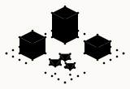

### A city block, nine tiles square — dark

`cityNight` — the same animation as its twin above; shown as a still, [self-playing copy](docs/cityNight.anim.svg) 40 kB · [page](docs/cityNight.html) with the runtime, 28 kB · [still](docs/cityNight.svg)

## Figures and studies

Everything else: the person, the handshake, the smaller experiments.

### A bear

`bear` — still · [page](docs/bear.html), 9 kB · [still](docs/bear.svg)

### A car

`car` — still · [page](docs/car.html), 6 kB · [still](docs/car.svg)

### Someone has been sitting in my chair

`chairs` — still · [page](docs/chairs.html), 11 kB · [still](docs/chairs.svg)

### Someone has been sleeping in my bed

`discovery` — still · [page](docs/discovery.html), 35 kB · [still](docs/discovery.svg)

### A person digging a ditch

`ditch` — still · [page](docs/ditch.html), 7 kB · [still](docs/ditch.svg)

### A person driving a car

`driving` — still · [page](docs/driving.html), 9 kB · [still](docs/driving.svg)

### Two people trade a bag of money for a briefcase

`exchange` — self-playing SVG, 316 kB · [page](docs/exchange.html) with the runtime, 31 kB · [still](docs/exchange.svg)

### Goldilocks

`girl` — still · [page](docs/girl.html), 6 kB · [still](docs/girl.svg)

### A person cycling through poses

`header` — self-playing SVG, 11 kB · [page](docs/header.html) with the runtime, 5 kB · [still](docs/header.svg)

### A desk lamp

`lamp` — still · [page](docs/lamp.html), 2 kB · [still](docs/lamp.svg)

### A person

`person` — still · [page](docs/person.html), 4 kB · [still](docs/person.svg)

### Someone has been eating my porridge

`porridge` — still · [page](docs/porridge.html), 11 kB · [still](docs/porridge.svg)

